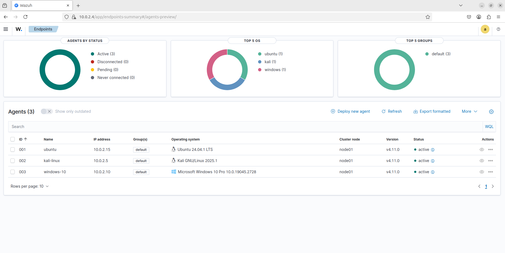
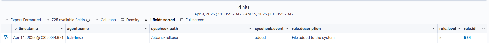
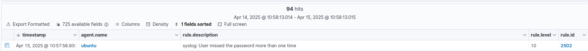
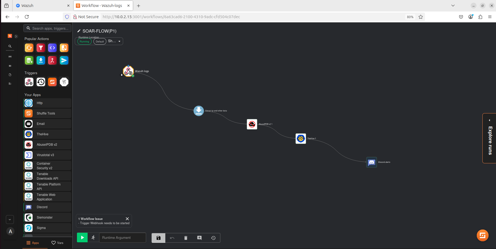
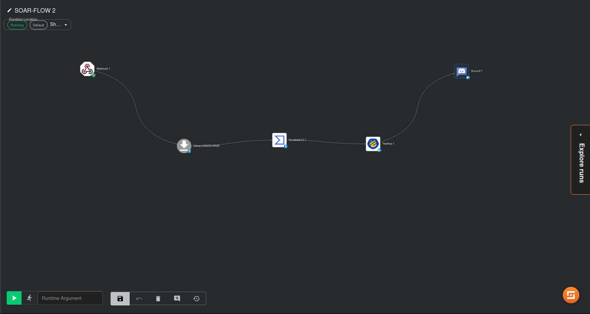
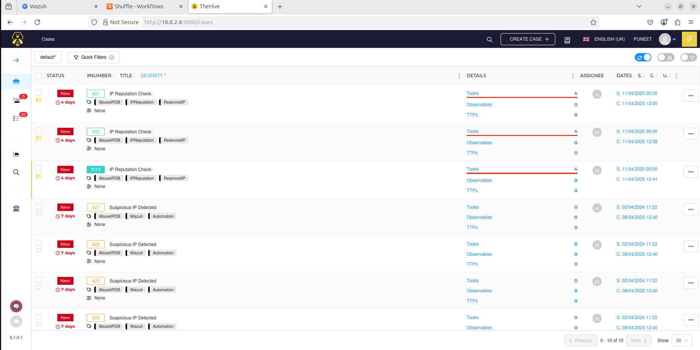
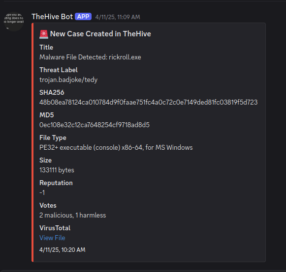

# 🛡️ SIEM & SOAR Integration Project

---

⚙️ **Integration of Wazuh (SIEM) with Shuffle (SOAR)**  
🐝 **Case Management with TheHive**  
🧪 **Threat Enrichment using VirusTotal & AbuseIPDB**  
🔔 **Real-time Notifications to Discord**

---

## 📌 Overview

This project demonstrates how to automate incident detection, enrichment, and response by integrating:
- 🖥️ **Wazuh** for Security Information and Event Management (SIEM)
- 🔄 **Shuffle** as the SOAR platform for automation
- 🐝 **TheHive** for case management
- 🧪 **VirusTotal** & 🌐 **AbuseIPDB** for threat enrichment
- 🔔 **Discord** to notify the security team in real time

---

## ⚙️ Components

| 🛠️ Tool / Service | 📋 Purpose                                                   |
| ----------------- | ----------------------------------------------------------- |
| **Wazuh** 🖥️      | Collects & analyzes security logs & events (SIEM)          |
| **Shuffle** 🔄    | Automates workflows, enrichment, notifications (SOAR)      |
| **TheHive** 🐝    | Manages & tracks security incidents as cases                |
| **VirusTotal** 🧪 | Checks file & URL reputation for enrichment                  |
| **AbuseIPDB** 🌐  | Provides IP reputation for enrichment                        |
| **Discord** 🔔    | Sends real-time alerts to the security team                  |

---

## 🧩 How It Works

- 🛡️ **Step 1:** Wazuh detects and analyzes security events.
- 📤 **Step 2:** Alerts are sent to Shuffle (via webhooks/API).
- 🤖 **Step 3:** Shuffle automates the response:
  - 📂 Create/update a case in TheHive.
  - 🧪 Enrich alerts with VirusTotal & AbuseIPDB data.
  - 🔔 Send a real-time notification to Discord.
- ✅ **Outcome:** Security analysts get enriched, actionable alerts and can respond faster.

---

## 📸 Screenshots

### 📊 Wazuh – Monitoring & Alerts

### 📊 Wazuh –File Integrity Monitoring alert details(Malware dropped on the File system]

### 📊 Wazuh – SSH brute Force alert details

### 🔄 Shuffle – Automated Workflow 1 

### 🔄 Shuffle – Automated Workflow 2

### 📁 TheHive – Case Management

### 🔔 Discord Notifications

---

## 🚀 Quick Setup

1. ⚙️ Deploy **Wazuh** and configure event rules.
2. 🔄 Install & configure **Shuffle** to receive alerts.
3. 🐝 Connect **TheHive** for case management.
4. 🧪 Get API keys for **VirusTotal** and 🌐 **AbuseIPDB**.
5. 🤖 Build Shuffle workflows to:
   - Handle alerts
   - Perform enrichment
   - Update TheHive cases
   - 🔔 Notify on Discord
  

---

## 📜 License
This project is licensed under the **MIT License**.  

